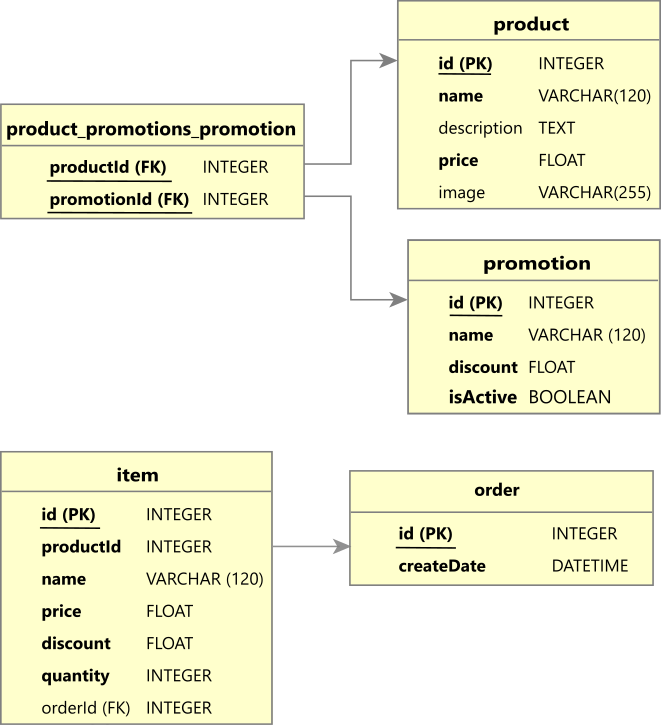

## Instalación 🔧

Para instalar las herramientas necesarias:

### Paso 1. Instalar Node.js

Acceder al sitio oficial de [Node.js](https://nodejs.org/), descargar e instalar.

### Paso 2. Instalar dependencias del proyecto

Accede a la carpeta del proyecto y ejecuta el siguiente comando:

```
npm install
```

### Paso 3. Compilar proyecto

```
npm run build
```

### Paso 4. Levantar servidor de desarrollo

```
npm run start
```

### Paso 5. Explorar endpoints API

> **Consultar promociones**: GET [/api/promotions](http://localhost:3000/api/promotions)

> **Consultar productos**: GET [/api/products](http://localhost:3000/api/products)

> **Crear pedido**: POST [/api/orders](http://localhost:3000/api/orders)

> *Request:*
```json
{
    "items": [
        {
            "productId": 1,
            "quantity": 12
        }
    ]
}
```
> **Crear productos**: POST [/api/products](http://localhost:3000/api/products)

> *Request:*
```json
[
    { 
        "name": "Tarta mousse de chocolate y baileys", 
        "price": 12,
        "image": "https://images.pexels.com/photos/4110003/pexels-photo-4110003.jpeg?auto=compress&cs=tinysrgb&w=1260&h=750&dpr=1"
    },
    { 
        "name": "Tarta de fresas con crema de vainilla", 
        "price": 6,
        "image": "https://images.pexels.com/photos/12846488/pexels-photo-12846488.jpeg?auto=compress&cs=tinysrgb&w=1260&h=750&dpr=1" 
    },
    { 
        "name": "Cheesecake de Nutella", 
        "price": 19,
        "image": "https://images.pexels.com/photos/15031855/pexels-photo-15031855.jpeg?auto=compress&cs=tinysrgb&w=600"
    }
]
```

> **Crear promociones**: POST [/api/promotions](http://localhost:3000/api/promotions)

> *Request:*
```json
[
    {
        "id": 1,
        "name": "Jueves de feria",
        "discount": 50,
        "isActive": true
    },
    {
        "id": 2,
        "name": "Martes en familia",
        "discount": 20,
        "isActive": true
    }
]
```

## Pruebas unitarias 💋

```
npm run test
```

✅ Crea nuevos productos

✅ Crea nuevas promociones

✅ Asocia promociones a productos

✅ Si producto tiene varias promociones, indica la promoción con mayor descuento

✅ Si promociones asociadas a un producto tienen mismo descuento, selecciona la primera

✅ Si promoción desactivada esta asociada a un producto, no mostrar promoción

✅ Calcula precio de producto con descuento por cada promoción

✅ Crea nuevo pedido

## Base de datos :floppy_disk:

### Modelo Lógico Relacional


