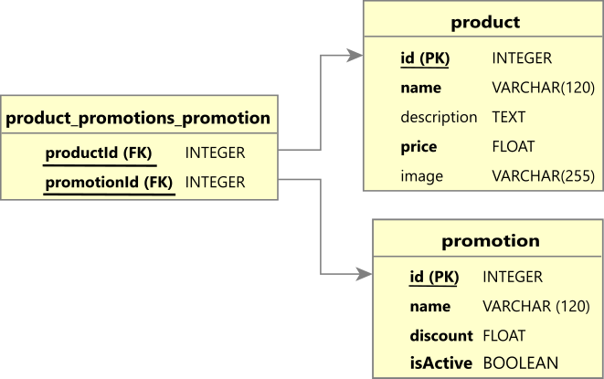

## Instalación 🔧

Para instalar las herramientas necesarias:

### Paso 1. Instalar Node.js

Acceder al sitio oficial de [Node.js](https://nodejs.org/), descargar e instalar.

### Paso 2. Instalar dependencias del proyecto

Accede a la carpeta del proyecto y ejecuta el siguiente comando:

```
npm install
```

### Paso 3. Compilar proyecto

```
npm run build
```

### Paso 4. Levantar servidor de desarrollo

```
npm run start
```

> **Consultar Promociones**: [/api/promotions](http://localhost:3000/api/promotions)


## Pruebas unitarias 💋

```
npm run test
```

✅ Crea nuevos productos

✅ Crea nuevas promociones

✅ Asocia promociones a productos

✅ Si producto tiene varias promociones, indica la promoción con mayor descuento

✅ Si promociones asociadas a un producto tienen mismo descuento, selecciona la primera

✅ Si promoción desactivada esta asociada a un producto, no mostrar promoción

✅ Calcula precio de producto con descuento por cada promoción

## Base de datos :floppy_disk:

### Modelo Lógico Relacional


